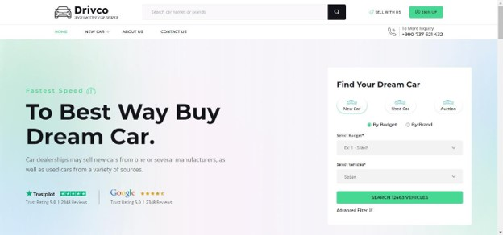
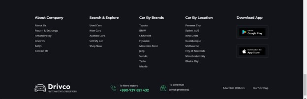

# Car Auction Website

## Abstract

This project report presents the comprehensive design, development, and implementation of a dynamic car auction website, developed using a combination of HTML, CSS, JavaScript, Tailwind, PHP, and MySQL. The primary objective of the website is to create a robust platform that facilitates real-time search, online sales, and auctions of cars.

The website is designed to provide a seamless and intuitive user experience, enabling users to easily search for cars based on various criteria such as category, brand, price range, year, and mileage. Users can also list their cars for sale, participate in auctions, and manage their activities through features such as the cart and wishlist.

Key functionalities of the website include:

- Real-time search: Users can perform detailed searches for cars using multiple filters.
- Online sales: New cars can be added to the cart and purchased through a streamlined checkout process.
- Car auctions: Used cars can be auctioned, with a bidding system that includes a points mechanism to manage user participation.
- Location tracking: The website uses IP-based location tracking to enhance user experience and provide relevant information.

## Installation

1. Clone the repository: `git clone https://github.com/sharjeel-siddiqui12/Car-auction-using-PHP.git`
2. Navigate to the project directory: `cd Car-auction-using-PHP`
3. Import the database: Use the provided SQL file to import the database structure and sample data.
4. Configure the database connection: Open the `config.php` file and update the database credentials.
5. Start the PHP development server: Run `php -S localhost:8000` to start the server.
6. Access the application: Open your web browser and visit `http://localhost:8000`.

## Usage

1. Register a new account or log in with existing credentials.
2. Browse the available car listings.
3. Place bids on cars you are interested in.
4. Monitor the auction progress and receive notifications.
5. If you win an auction, proceed with the payment process.
6. Sellers can manage their listed cars and monitor bidding activity.

## Technologies Used

- Front-end: HTML, CSS, JavaScript, Tailwind
- Back-end: PHP
- Database: MySQL
- Development Tools: VS Code, Github

## Project Scope

The project encompasses the development of a car auction website with the following features:

- User registration and login for buyers and sellers.
- Real-time car search with multiple filters.
- Car sales and auction functionality.
- Cart, checkout, and wishlist management.
- Location-based tracking.
- Email notifications for bidding and auction results.
- Membership plans for extended bidding capabilities.

## Overview of Project

The car auction website is structured into several key modules:

- User Management: Registration, login, and profile management.
- Car Listings: Adding, updating, and deleting car listings.
- Search and Filter: Real-time search with various filters.
- Auction System: Bidding, bidding points, and auction status.
- Transaction Management: Cart, checkout, and payment processing.
- Notification System: Email notifications for bidding and auctions.

## Tools and Technologies

- Front-end: HTML, CSS, JavaScript, Tailwind
- Back-end: PHP
- Development Tools: VS Code, Git
- Database: MySQL

## Implemented Concepts

1. **HTML and CSS**
   - HTML: Used for structuring the web pages with elements such as headers, paragraphs, forms, and buttons.
   - CSS: Used for styling the web pages, including layout design, color schemes, fonts, and responsive design.

2. **JavaScript and Tailwind**
   - JavaScript: Used for client-side scripting, including form validation, dynamic content updates, and event handling.
   - Tailwind: A JavaScript library for building user interfaces, enabling the creation of reusable components and managing the application state.

3. **PHP and MySQL**
   - PHP: Used to handle server-side logic, including form submissions, session management, and interactions with the database.
   - MySQL: A relational database management system used to store and retrieve data efficiently.

## Screenshots

## Conclusion

This project successfully developed a comprehensive car auction website with real-time search, auction, and transaction capabilities. By utilizing modern web technologies, the platform provides a user-friendly and efficient marketplace for car buyers and sellers. Future enhancements will focus on expanding functionality and improving user experience.

## License
This project is licensed under the MIT License. See the [LICENSE](./LICENSE) file for more details.
